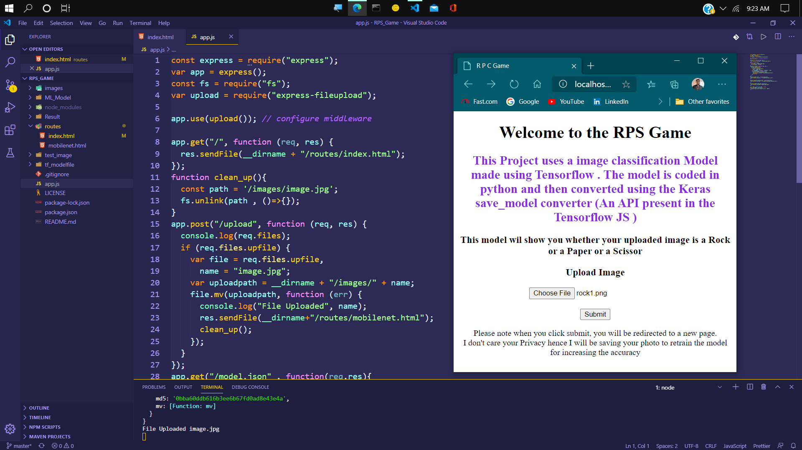
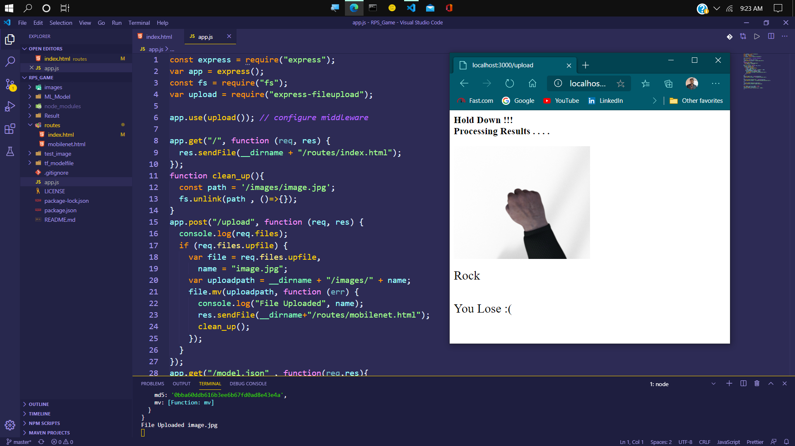
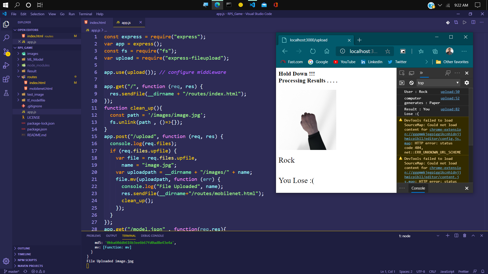
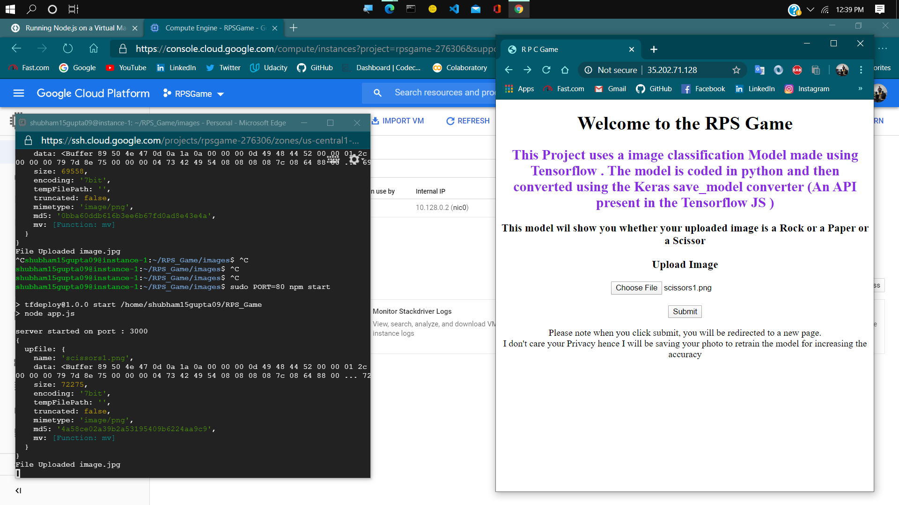
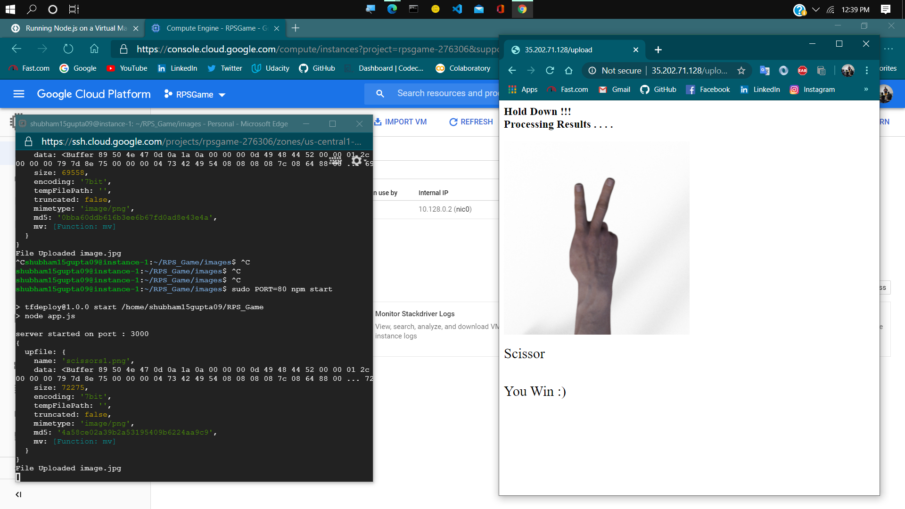
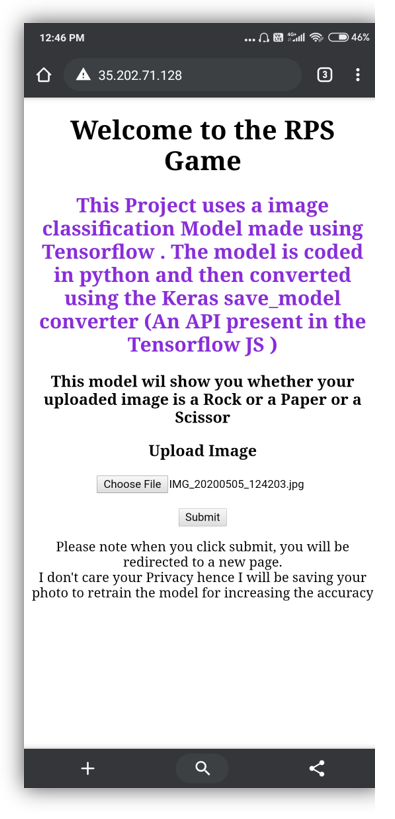

    <h1>RPS_Game :</h1>
    
A rock paper scissor game on web

    <h1>Timeline</h1>  
    
May 5th 20 , 11.59 pm IST

    <h3>Completed on Time :) Yeh !

    <h1>Progress : </h1>
    <ul>
      <li>ML Model : Done</li>
      <li>Tensorflow js conversion : Done</li>
      <li>Basic Web Page : Done</li>
      <li>Tensorflow js integration : Done</li>       
      <li>Classification on test images : Working (Done)</li>
      <li>Node JS setup and Routes : Done</li>
      <li>Deploymentb : Tested on Google Cloud Using a Virtual machine (Done)</li>
      </ul>

        <h3> I have deleted the VM , to avoid extra charges .Hence not able to share a link to use this .
    Checkout the ScreenShot below</h3>

    <h1> UI </h1>
    <h3> In PC </h3>
    
    
The Very First Page / Landing Page for the Game 

     
    
    
The Result Page

     
    
    
Console Log for getting the information regardinhg the prediction from Computer 

     
    
    
Deployed on Gogle Cloud Result - Landing page

     
    
    
Deployed on Gogle Cloud Result

     
    <h3> On Mobile Platform </h3>
    
    
Deployed on Gogle Cloud - Landing Page on mobile

     
              

    <h1>Requirements :</h1>
    1 . ML Model
    <ul>
      <li>1 . To develope a Machine Learning algorithm to classify and detect the rock paper and scissor hand gestures</li>
      <li>2 . Model conversion so that we can use it for tensorflow js </li>
    </ul>
    2 . Web App
    <ul>
      <li>1 . Front -End :  UI for the Web Game ( It should contain a DIV which can render live damera feed so that a frame can be craptured for playing the game) </li>
      <li>2 . Back-End : for Routes and integrating the Tensorflow JS </li>
    </ul>
    3 . Deployment
    <ul>
      <li>1 . localhost:8000 </li>
      <li>2 . Virtual Machine ( weither in GCloud or Azure )</li>
      <li>3 . Docker Image</li>
    </ul>

    <h1>Want to contribute ?? </h1>
    Welcome ! :) 
    Just fork this repo and start working . Check the Requirements below  
    Waiting for your PR

    <h1>Privacy Concern</h1>
    
As the user is required to upload the image . We respect the Privacy of the user . We will use the Images for training our ML Model

    
I am in the process of introducing the feature to delete your Data once you close the game

# Tech Used
1 . Tensorflow , Tensorflow JS , Keras  
2 . JavaScript , Python 
3 . HTML , CSS 
4 . NodeJs , Express , Express-fileupload  

# How to use ?
<ul>
    <li>Using LocalHost  
        1 . clone this project  
        2 . npm install 
        3 . npm start 
        4 . Just upload a photo by using the upload button and that's it !! You are good to go. 
    </li>
    <li>Using Virtual Machine  
        1 . Create a VM on Google cloud / Azure  (os = linux)   
        2 . Open the SSH terminal  
        3 . Install Nodejs  
        4 . clone this project  and * cd RPC_Game *  
        5 . npm start     
    </li>
</ul>
Note you have to change the src for the image accordingly  
## Special Thanks

<a href="https://github.com/mohakbahal">Mohak Bahal</a> : For solving issue with Keras Model Conversion 
 
